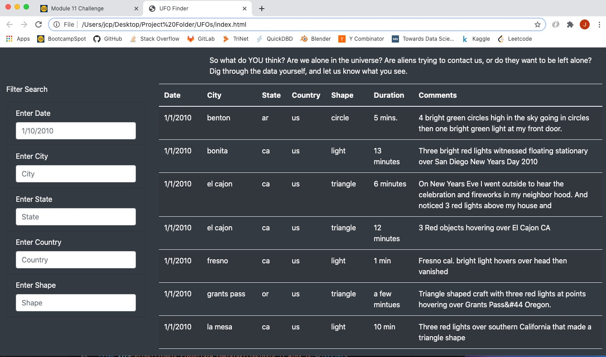
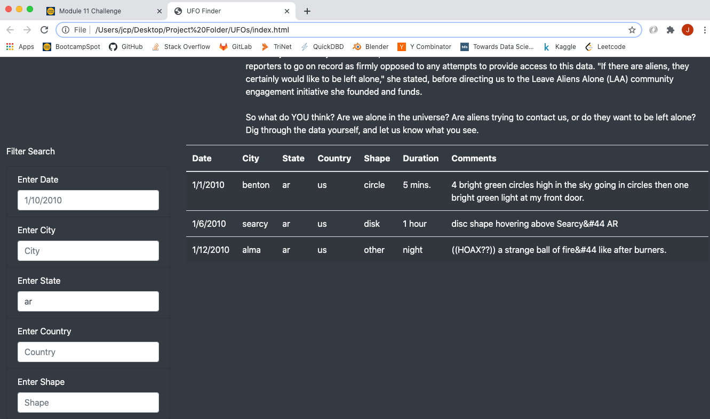

# UFOs

## Project Overview

The goal of this project is to create a webpage that can filter UFO sighting data based on user input. This will help the UFO enthusiast community track and view UFO sightings in the US and Canada. The ability to filter by country, state, city, UFO shape, and date will all help create a powerful user experience for those visiting this website.

## Results

For someone using the webpage, they must first identify what metric they want to filter by. For example, if the user wants to filter by state, they will type in the desired state's abbrevation in lowercase letters and click outside of the input box for the filter render in the table. **Figure 1** shows the filters and table before entering any search criteria, and **Figure 2** shows the filters and table after entering search criteria and clicking outside of the input box. **Figure 3** demonstrates filtering by multiple criteria, using the same method as filtering by one criteria.

### Figure 1

### Figure 2

